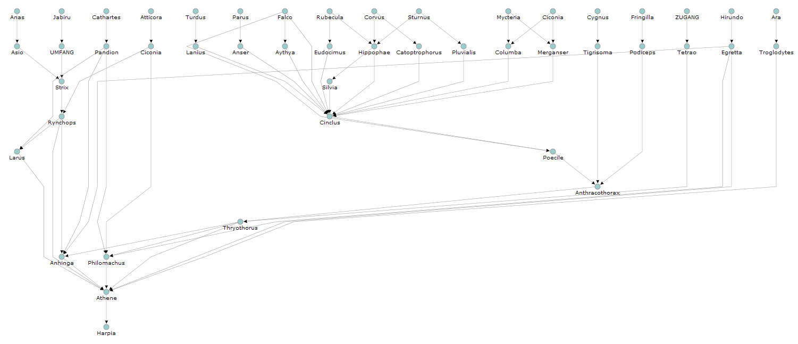

dGraph
======

Create layered directed graphs in SVG with a few lines of JS in a beautiful and compact layout. The library is based on
a modified [Sugiyama algorithm](http://en.wikipedia.org/wiki/Kozo_Sugiyama "Kozo Sugiyama"). The data feed into the graph
library needs to be a node list with its corresponding adjacency list. Each node object in the list is expected to have
at least the two properties 'label' and 'layer'. See the two provided example pages
[example-simple.htm](example-simple.htm) and [example-complex.htm](example-complex.htm) for more information.

## History
Originally developed for the Data Analysis Software NAFIDAS of the [Swiss National Forest Inventory](http://www.lfi.ch)
to visualize dependencies of database variables.

## Features
* Client side rendering of the graph in SVG.
* Mesh size of the grid can be set.
* Grid can be set to be visible or hidden.
* Graph can be compacted to save space on the screen (default).
* Simple data format consisting of a node list and an adjacency list.
* Graph can be inverted, e.g. order of layers in graph is reversed.
* Highlight connected parent and/or child nodes

## Dependencies
* dojo toolkit 1.9.1, mainly for the AMD loader to required in the modules

## Installation
See the two example pages [example-simple.htm](example-simple.htm) and [example-complex.htm](example-complex.htm)

## Licence
GNU GENERAL PUBLIC LICENSE v3